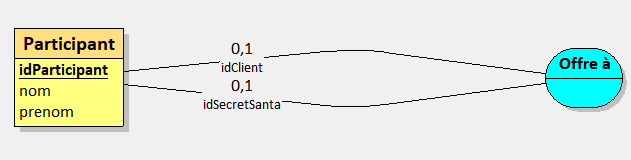

# Projet Secret Santa

Secret Santa, le projet!

## Objectifs pédagogiques

- Formulaire HTML / CSS
- Javascript
  - Lecture et Manipulation du DOM
  - AJAX
- PHP
  - Recueil de données en POST
  - Accès à une base de données en sqlite
- SQL
  - Utilisation de sqlite
  - Requêtes simples
    - Insertion en base
    - Lecture

## Analyse du projet

https://miro.com/app/board/uXjVNKoFbVA=/

## Prototype du tirage au sort

https://codepen.io/liliwol/pen/RwvqOoy?editors=1010

## Base de données

### Conception

### Requêtes

* Lecture des données

* Ajout d'un participant

* Ecriture du resultat d'un tirage

* Suppression de tous les participants